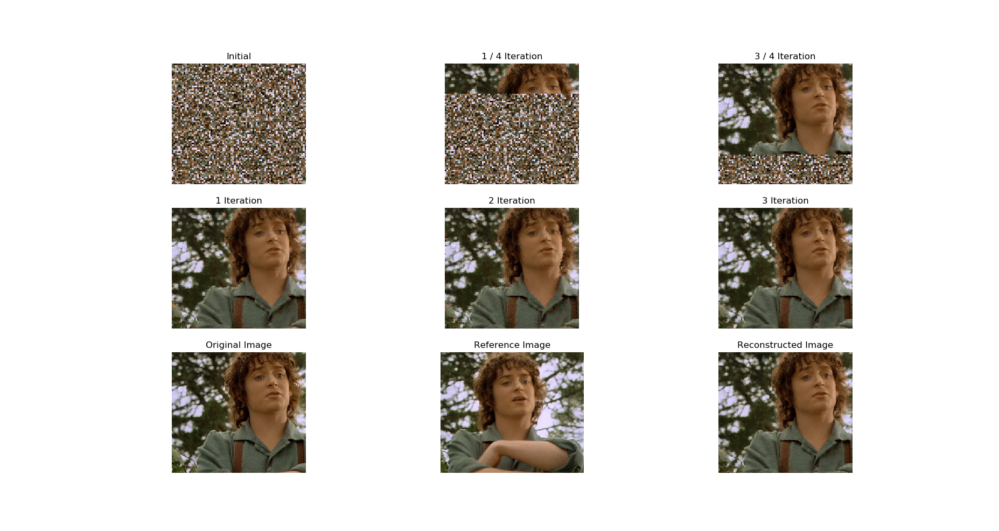
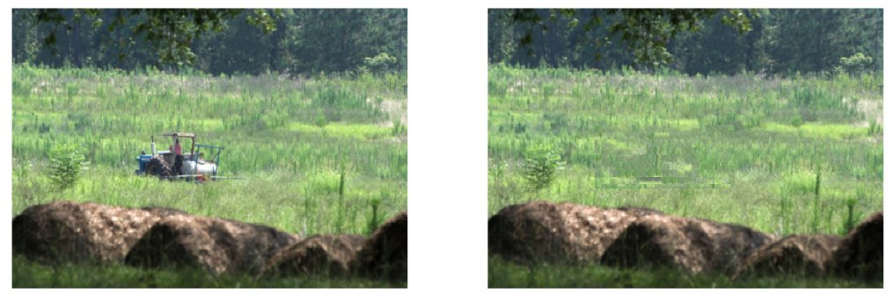

# PatchMatch
As a part of Digital Image Processing course in this project we tried to implement the patchmatching algorithm as suggested in the paper https://gfx.cs.princeton.edu/pubs/Barnes_2009_PAR/patchmatch.pdf

## Algorithm

The patchmatch algorithm used in this project is based on Approximate Nearesrt Neighbour Field (NNF) method.

We find the matching path by randomly selecting a path initially and imporvising the match throughout the ourse of the algorithm. The algorithm consists of 3 major steps:

1. <b>Intialization</b>

 - In this step the NNF matrix is initalized with the path centers. Usually we initalize with random centers but if we have some prior knoledge of the image we can use that for better initialization as well.

2. <b> Propagation </b>

  - This step exploits the porperty of coherence in the image. The core of this step is based on the assumption that if we have a correctly matching patch at position (x-1,y) and (x,y-1) we can use them to find the matching patch at (x,y) position if it is in the coherent region.
3. <b> Random Search </b>

 - As the name suggest in this step we look for better patch for a given position. We search in exponentially decreasing radius search area to find the best candidate patch.

 After initialization, Propagation and Random Search steps are done in iteration one after other, like P1,S1,P2,S2,P3,S3....

### Python Libraries Required
  - Numpy
  - Opencv-python
  - Matplotlib
  - Flask

  All requirements are written in requirements.txt, to install these libraries run the following command:

  ```
  foo@bar:~$ pip install -r requirements.txt
  ```

  For `Anaconda` users, run the following commands:
  ```
  foo@bar:~$ conda install -c anaconda numpy
  foo@bar:~$ conda install -c anaconda opencv
  foo@bar:~$ conda install -c conda-forge matplotlib
  ```

### Other Requirements
  - tkinter
  ```
  foo@bar:~$ sudo apt-get install python3-tk
  ```

### File Structure

 There are two main files `patchmatch_whole_image.py` and `patchmatch_object_removal.py`.

 `patchmatch_whole_image.py` is used to implement the basic patchmatch algorithm for given two images A and B. (A is matched with B). To run this file execute the following command,

 ```
 foo@bar:~$ python3 patchmatch_whole_image.py <input_image> <target_image> <patch_size> <iterations>
 ```
`patchmatch_object_removal.py` is an extension of the proposed algorithm to use it for object removal from images. To run this file execute the following command,

```
foo@bar:~$ python3 patchmatch_object_removal.py <input_image> <target_image> <patch_size> <iterations>
```

#### Steps:
  1. After executing the above command user will be shown the `input_image`.
  2. User needs to draw a rectandle using mouse around the objects that is needed to be removed.
  3. Press `c` to select the target image or `r` to redraw to rectagle. Press `q` is satisfied by cropped image.
  4. After that user will be shown the `target_image`
  5. User needs to draw rectangle around the area/texture with which the objects selected in the previous image needs to be replaced.
  6. Repeat step `3` to get cropped image of target_image
  7. After this the algorithm will run and user will be shown the `input_image` after removing the selected objects as a final result.

### Flask Application

 To make the use of this tool easy we also have built a small Flask web application where user can upload images from their local storage and see the results.

 To run the flask app execute the following command,
 ```
foo@bar:~$ cd FlaskApp
foo@bar:~$ python3 app.py    
 ```
Then go to localhost to use the app.

- Upload input image in the left box.
- Upload refence image in the right box.
- Press `run` button to get ouput. 

### Results
  
  


### Contributors

- [Kunal Vaswani](https://github.com/kunalvaswani123)
- [Anchit Gupta](https://github.com/Anchit1999)
- [Neel Trivedi](https://github.com/neel1998)
